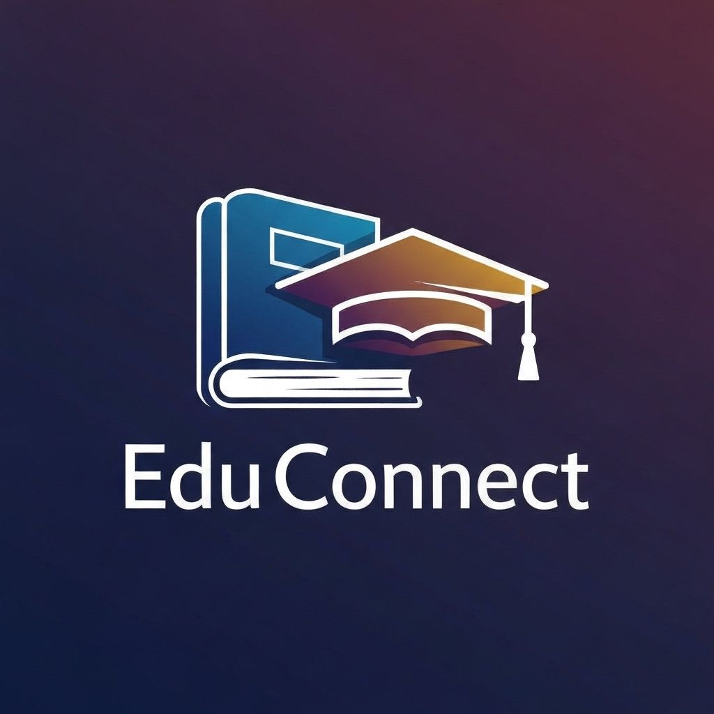

# EduConnect - Quality Education Platform

## Overview

EduConnect is a web-based educational platform that connects students and teachers to facilitate quality education. Built with Flask and MySQL, it provides a comprehensive learning management system aligned with **UN Sustainable Development Goal 4: Quality Education**.

## SDG 4 Alignment - Quality Education

EduConnect directly supports SDG 4 by:

- **Ensuring inclusive and equitable quality education** - Providing free access to educational resources for all students
- **Promoting lifelong learning opportunities** - Enabling continuous learning through lesson sharing and progress tracking
- **Facilitating teacher-student collaboration** - Creating a platform for meaningful educational interactions
- **Improving access to educational resources** - Allowing teachers to upload and share study materials easily
- **Tracking learning progress** - Helping students monitor their educational journey

## Tech Stack

- **Backend**: Flask (Python)
- **Database**: MySQL
- **Frontend**: HTML, CSS, JavaScript, Bootstrap 5
- **Authentication**: Flask-Login with secure password hashing
- **File Handling**: Werkzeug for secure file uploads

## Features

### User Authentication
- Secure registration and login system
- Role-based access control (Teachers and Students)
- Password hashing using Werkzeug security

### Teacher Dashboard
- Create and manage lessons
- Upload educational resources (PDFs, documents, presentations)
- View all created lessons and materials
- Track student engagement

### Student Dashboard
- Browse available lessons from all teachers
- View lesson details and download resources
- Mark lessons as completed
- Track personal learning progress

### Resource Library
- Upload and download study materials
- Support for multiple file formats
- Organized by lessons for easy access

### Discussion Forum
- Interactive platform for students and teachers
- Post topics and engage in educational discussions
- View posts from all community members

### Progress Tracker
- Monitor completed lessons
- View learning history
- Track educational milestones

## Setup & Installation

### Prerequisites

- Python 3.8 or higher
- MySQL Server 8.0 or higher
- pip (Python package manager)

### Step 1: Clone the Repository

\`\`\`bash
git clone <repository-url>
cd educonnect
\`\`\`

### Step 2: Install Dependencies

\`\`\`bash
pip install -r requirements.txt
\`\`\`

### Step 3: Setup MySQL Database

1. Start your MySQL server
2. Create a new database:

\`\`\`sql
CREATE DATABASE educonnect;
\`\`\`

3. Create a MySQL user (optional but recommended):

\`\`\`sql
CREATE USER 'educonnect_user'@'localhost' IDENTIFIED BY 'your_password';
GRANT ALL PRIVILEGES ON educonnect.* TO 'educonnect_user'@'localhost';
FLUSH PRIVILEGES;
\`\`\`

### Step 4: Configure Environment Variables

1. Copy the example environment file:

\`\`\`bash
cp .env.example .env
\`\`\`

2. Edit `.env` and update with your MySQL credentials:

\`\`\`env
DB_HOST=localhost
DB_USER=educonnect_user
DB_PASSWORD=your_password
DB_NAME=educonnect
SECRET_KEY=your-secret-key-here
\`\`\`

### Step 5: Initialize the Database

Run the database initialization script:

\`\`\`bash
python database.py
\`\`\`

This will create all necessary tables (users, lessons, resources, discussions, progress).

### Step 6: Run the Application

\`\`\`bash
python app.py
\`\`\`

The application will be available at `http://localhost:5000`

## Database Schema

### Users Table
- `id` (INT, Primary Key)
- `name` (VARCHAR)
- `email` (VARCHAR, Unique)
- `password` (VARCHAR, Hashed)
- `role` (ENUM: 'student', 'teacher')
- `date_joined` (DATETIME)

### Lessons Table
- `id` (INT, Primary Key)
- `title` (VARCHAR)
- `description` (TEXT)
- `teacher_id` (INT, Foreign Key)
- `created_at` (DATETIME)

### Resources Table
- `id` (INT, Primary Key)
- `lesson_id` (INT, Foreign Key)
- `file_path` (VARCHAR)
- `uploaded_by` (INT, Foreign Key)
- `uploaded_at` (DATETIME)

### Discussions Table
- `id` (INT, Primary Key)
- `topic` (VARCHAR)
- `message` (TEXT)
- `user_id` (INT, Foreign Key)
- `created_at` (DATETIME)

### Progress Table
- `id` (INT, Primary Key)
- `student_id` (INT, Foreign Key)
- `lesson_id` (INT, Foreign Key)
- `status` (ENUM: 'in-progress', 'completed')
- `updated_at` (DATETIME)

## Usage Guide

### For Teachers

1. Register as a teacher
2. Login to access the teacher dashboard
3. Create lessons with detailed descriptions
4. Upload resources (PDFs, documents) for each lesson
5. Participate in forum discussions

### For Students

1. Register as a student
2. Login to access the student dashboard
3. Browse available lessons
4. View lesson details and download resources
5. Mark lessons as completed
6. Track your progress
7. Engage in forum discussions

## Project Structure

\`\`\`
educonnect/
├── app.py                 # Main Flask application
├── database.py            # Database connection and initialization
├── models.py              # User model for Flask-Login
├── requirements.txt       # Python dependencies
├── .env.example          # Environment variables template
├── .gitignore            # Git ignore file
├── static/
│   ├── css/
│   │   └── style.css     # Custom styles
│   ├── images/
│   │   ├── logo.png      # EduConnect logo
│   │   └── hero-image.png
│   └── uploads/          # Uploaded resources
├── templates/
│   ├── base.html         # Base template
│   ├── index.html        # Homepage
│   ├── login.html        # Login page
│   ├── register.html     # Registration page
│   ├── teacher_dashboard.html
│   ├── create_lesson.html
│   ├── upload_resource.html
│   ├── student_dashboard.html
│   ├── view_lesson.html
│   ├── forum.html        # Discussion forum
│   └── progress.html     # Progress tracker
└── docs/
    └── pitch_deck.pdf    # Project pitch deck
\`\`\`

## Security Features

- Password hashing using Werkzeug's security functions
- Secure file upload with filename sanitization
- Role-based access control
- Session management with Flask-Login
- Environment variable protection for sensitive data
- SQL injection prevention through parameterized queries

## Live Demo

[COMING SOON]

## Contributing

Contributions are welcome! Please feel free to submit a Pull Request.

## License

This project is open source and available under the MIT License.

## Contact

For questions or support, please open an issue in the GitHub repository.

---

**EduConnect** - Empowering education, one lesson at a time. Aligned with SDG 4: Quality Education.

